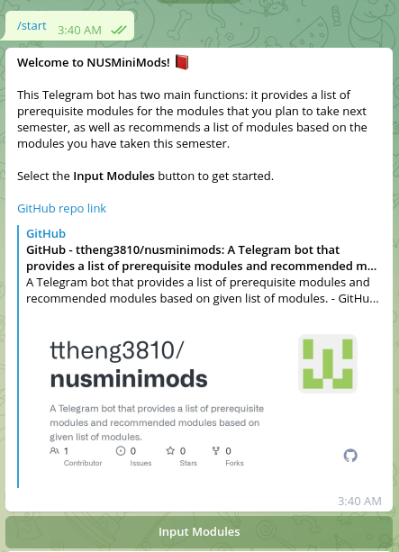
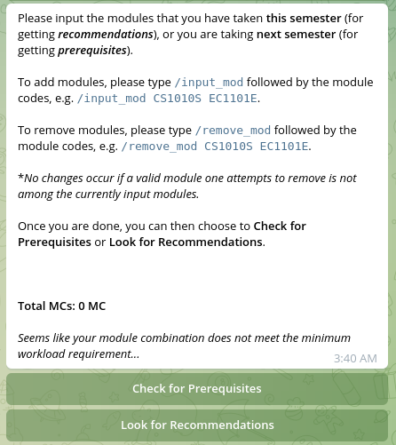
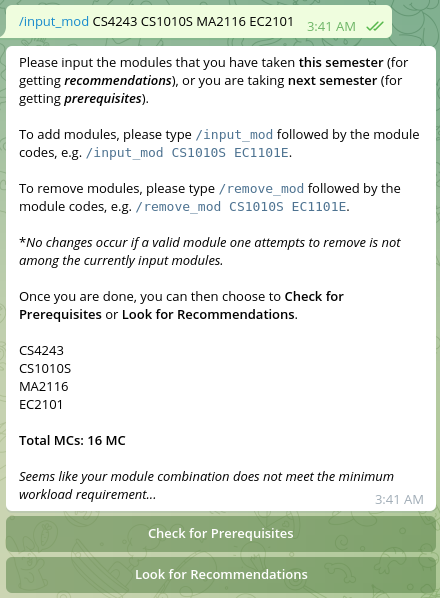
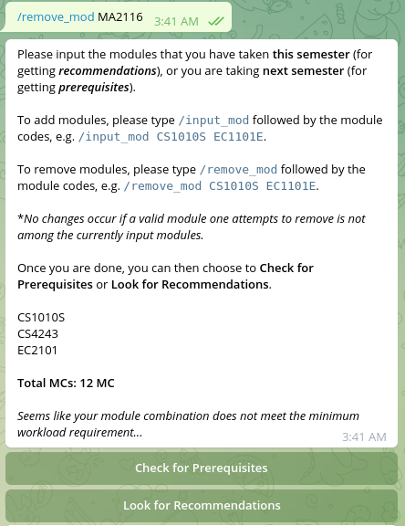
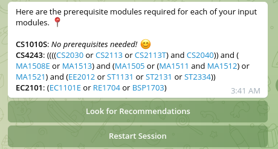
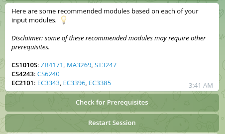
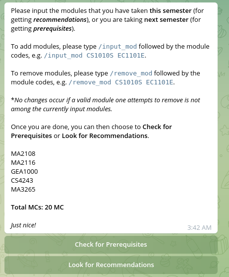
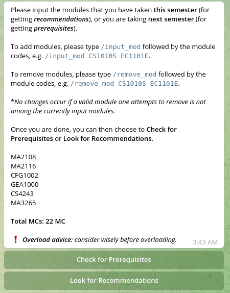

## NUSMiniMods 📕

Are you an NUS (National University of Singapore) student who may be struggling to get your module planning sorted but confused by the sometimes disorienting chain of prerequisites? Or not sure what modules to take next semester? Or just being too busy due to hall activities or lazy to search for them on [NUSMods](https://nusmods.com/)? Fret not, **NUSMiniMods**, the miniature, light-weight version of a module planner now comes in handy!

### What's this?

NUSMiniMods is a Telegram bot that has two main functions: providing a list of prerequisite modules for the modules that you plan to take next semester and recommending a list of modules based on the modules you have taken this semester.

### Notable features

- MC (Modular Credit) calculator as users input their desired list of modules
- Overloading/underloading advice
- Links to NUSMods module page included
- Modules not offered filtered out from search results

### Some technical information

This Telegram bot is built entirely with Python, referencing tutorials provided by the hackathon organiser (such as [this one](https://www.youtube.com/watch?v=zdH48PQddZ0)), as well as various other online resources.

The NUS module data is fetched from the [API](https://api.nusmods.com/v2/) provided by NUSMods.

Some third-party dependencies used in this project:-
- [python-telegram-bot](https://python-telegram-bot.org/) (13.14+)
- [requests](https://requests.readthedocs.io/en/latest/) (2.28.1+)

### Sample executions

- Starting message

- Inputting and removing modules

 
 

- Returning prerequisite/recommended modules

- MC notes

### Limitations and possible improvements

- Timetable clashes, etc. are not accounted for the module combinations in this bot.
- Although the recommended modules provided by this bot have considered the fulfilment of prerequisites, they are still randomly chosen. The implementation of more personalised recommendation based on user feedback data should be more preferred.
- While simple-looking and OK in providing rough module plannings, this bot only considers modules taken in the current semester and also those to be taken in the following semester, hence it is not comprehensive enough to account for deeper prerequisite chains or other more nuanced circumstances.

### Footnote

NUSMiniMods is built for NUS Interhall Hackathon 2022, held on 5-6 December 2022.

